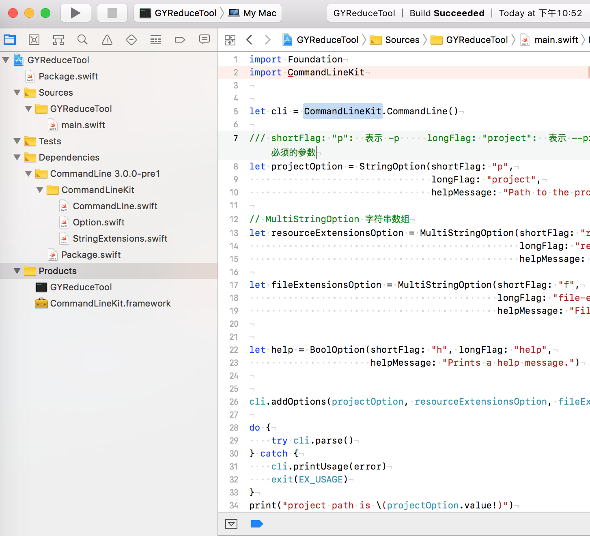

##  CommandLine ’ Usage

`   号外，号外，给用Mac机的小伙伴送福利来了，什么❓Swift写命令行工具，没听错吧？！`

`是的，就是这么时尚。自从Swift3.0引用了Swift package，写脚本就没任何门槛啦。`

`咱再也不用纠结需要东拼西凑得来一串蹩脚的Shell脚本了，`

`也不用每一行都要考虑Python的缩进了，`

`多个脚本文件互相引用？再也不成问题了`

`试着自己动手写一段Swift版本的命令工具吧，`

`不用不知道，一用就6到飞起！`

### 1.创建工作区
```shell
$> mkdir -p GYReduceTool
```
### 2.创建工程
```shell
$> swift package init --type executable
Creating executable package: GYReduceTool
Creating Package.swift 
Creating Sources/
Creating Sources/main.swift
Creating Tests/
```

### 3.修改依赖库
```swift
// swift-tools-version:4.0
// The swift-tools-version declares the minimum version of Swift required to build this package.

import PackageDescription

let package = Package(
    name: "GYReduceTool",
    products: [
        .executable(name: "GYReduceTool", targets: ["GYReduceTool"])
    ],
    dependencies: [
        // Dependencies declare other packages that this package depends on.
        // .package(url: /* package url */, from: "1.0.0"),
        .package(url: "https://github.com/jatoben/CommandLine", from: "3.0.0-pre1"),
    ],
    targets: [
        // Targets are the basic building blocks of a package. A target can define a module or a test suite.
        // Targets can depend on other targets in this package, and on products in packages which this package depends on.
        .target(
            name: "GYReduceTool",
            dependencies: ["CommandLine"]),
    ]
)
```

### 4.配置依赖库
```shell
$> swift package update
Updating https://github.com/jatoben/CommandLine
$>
```
### 5.运行
```shell
$> swift run GYReduceTool
Hello, world!
$>
```


### 6.生成Xcode工程

（还是Xcode编辑是我熟悉的，讲了这么多，就这个吸引我勒）

```shell
$> $ swift package generate-xcodeproj
generated: ./GYReduceTool.xcodeproj
$>
```
## 要接收参数怎么办呢？
### [7. 用一下CommandLineKit解析参数吧](https://travis-ci.org/jatoben/CommandLine)

A pure Swift library for creating command-line interfaces.

*Note: CommandLineKit `master` requires Xcode 8 / Swift 3.0. If you're using older versions of Swift, please check out the [earlier releases](https://github.com/jatoben/CommandLine/releases).*

```swift
// main.swift
import Foundation
import CommandLineKit

let cli = CommandLineKit.CommandLine()

/// shortFlag: "p":  表示 -p     longFlag: "project":  表示 --project   required: false  是否为必须的参数
/// (是不是很像Python的参数解析呢)
let projectOption = StringOption(shortFlag: "p",
                                 longFlag: "project",
                                 helpMessage: "Path to the project.")

// MultiStringOption 字符串数组
let resourceExtensionsOption = MultiStringOption(shortFlag: "r",
                                                 longFlag: "resource-extensions",
                                                 helpMessage: "Extensions to search.")

let fileExtensionsOption = MultiStringOption(shortFlag: "f",
                                             longFlag: "file-extensions",
                                             helpMessage: "File Extensions to search.")


let help = BoolOption(shortFlag: "h", longFlag: "help",
                      helpMessage: "Prints a help message.")
                      
cli.addOptions(projectOption, resourceExtensionsOption, fileExtensionsOption, help)
do {
    try cli.parse()
} catch {
    cli.printUsage(error)
    exit(EX_USAGE)
}
print("project path is \(projectOption.value!)")
print("resourceExtensions is \(resourceExtensionsOption.value!)")
print("fileExtensions is \(fileExtensionsOption.value!)")

```

```shell
// 输出
$>  swift run GYReduceTool -p hello 111 -r image jgo -f png jpg
Compile Swift Module 'GYReduceTool' (1 sources)
project path is hello
resourceExtensions is ["image", "jgo"]
fileExtensions is ["png", "jpg"]

```
附上Xcode工程结构


## 就没啦？！我还要学~

### 1.[CommandLineKit](https://travis-ci.org/jatoben/CommandLine)

A pure Swift library for creating command-line interfaces.

*Note: CommandLineKit `master` requires Xcode 8 / Swift 3.0. If you're using older versions of Swift, please check out the [earlier releases](https://github.com/jatoben/CommandLine/releases).*


### 2.[Example Usage - Swift Package](https://swift.org/getting-started/#package-manager)
The Swift Package Manager is a tool for managing the distribution of Swift code.

### 3.[swift 开发命令行工具 - 简书](https://www.jianshu.com/p/1c008bb2656f)